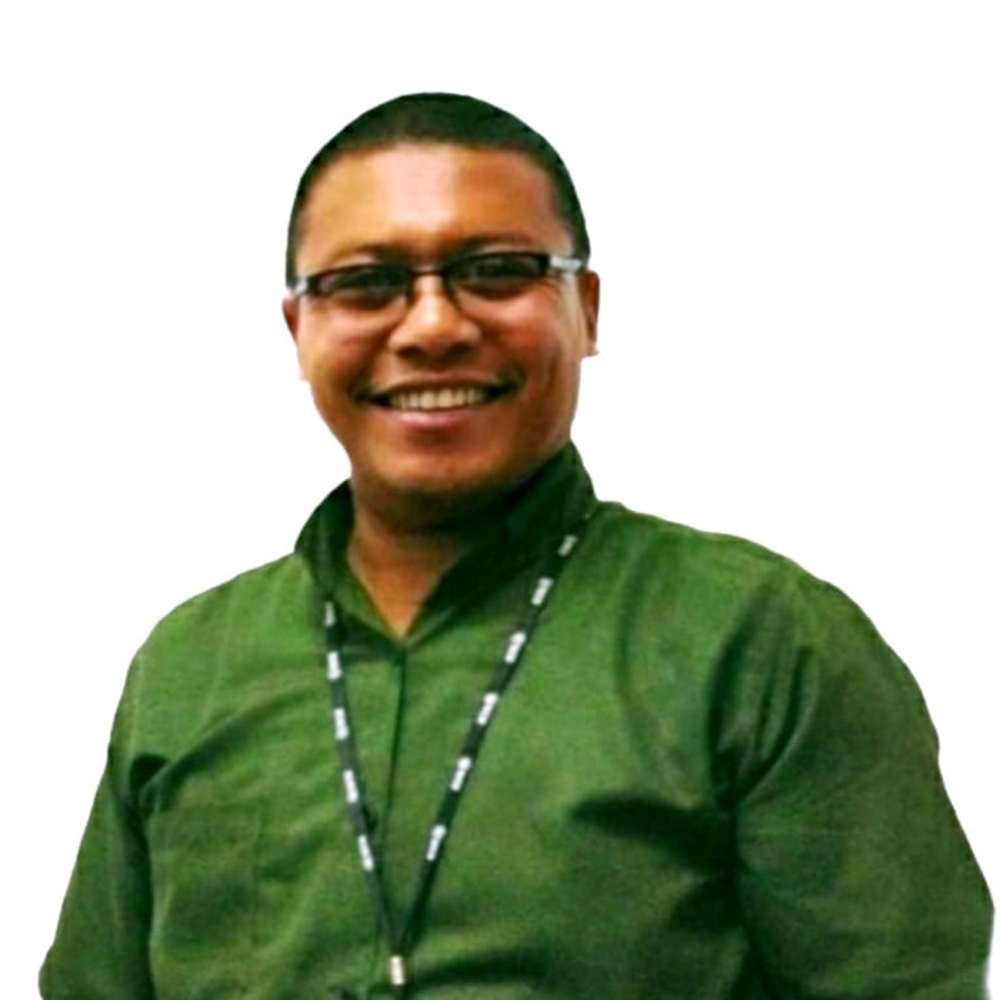
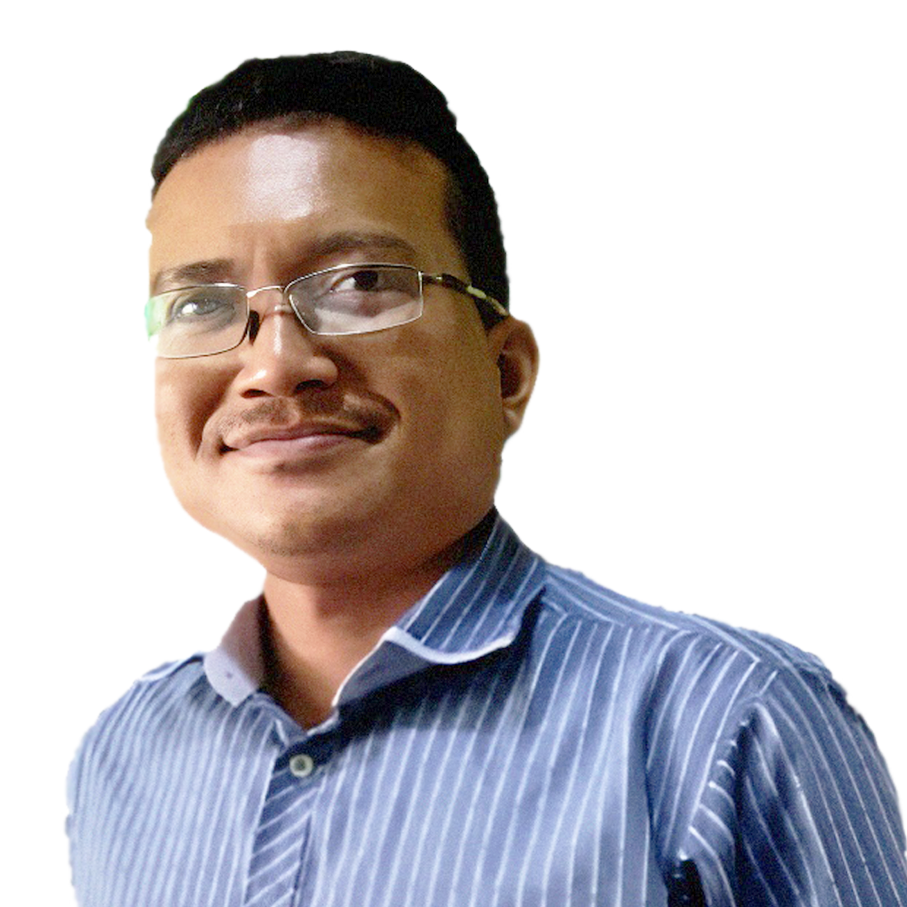
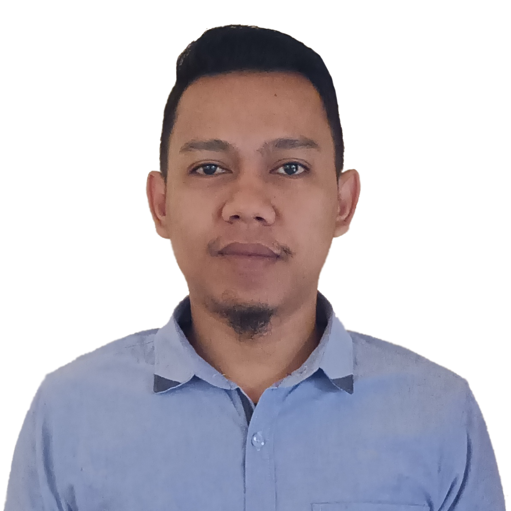

<h1>PT BINTANG MUDA INDONUSA</h1>
<h3>Layanan Jasa Pengurusan Dokumen, Konsultan Bisnis dan Keuangan</h3>

<h4>Produk / Layanan :</h4>
<ul>
  <li>⭐ PT Perseroan (Promo)</li>
  <li>⭐ PT Perseroan (Exclusive)</li>
  <li>⭐ CV / UD / Yayasan</li>
  <li>⭐ PT Perorangan</li>
  <li>⭐ PT Perorangan (Exclusive)</li>
  <li>⭐ Paket Company Profile</li>
  <li>⭐ Akta Penegasan (Notaril)</li>
  <li>⭐ Pembuatan Izin PIRT</li>
  <li>⭐ Pembuatan NPWP / NIB</li>
  <li>⭐ SPT Tahunan Badan Usaha</li>
  <li>⭐ SPT Tahunan Pribadi</li>
  <li>⭐ SBU / SKK / KTA</li>
  <li>⭐ Pengurusan Balik Nama Sertifikat Tanah</li>
  <li>⭐ Pengurusan Pengajuan Kredit Pinjaman Dana</li>
  <li>⭐ Dana Talangan</li>
</ul>  
<small><i>Khusus dana talangan bagi nasabah yang mau take over kredit dari bank, atau mau pelunasan angsuran di finance tapi tidak ada dana, dan mau pengajuan kredit ulang di tempat lain, kami siap bantu dana talangan, mulai dari 1juta Hingga 2,5milyar)</i>
  
<i>Dana talangan hanya berlaku di Sulawesi Utara, Kotamobagu dan Gorontalo saja</i></small>
  
<i>Note :</i>
 
<i>* Point 1 s/d 12 melayani pengurusan dokumen seluruh Indonesia</i>
 
<i>* Point 13 & 14 Hanya berlaku pengurusn dokumen se Provinsi Sulawesi Utara</i>

<h4>Formulir :</h4>
<table width="100%">
  <tbody>
    <tr>
      <td>Pendirian PT Badan Usaha</td>
      <td><a href="https://bintangmudaindonusa.github.io/formulir-pendirian-pt-badan-usaha.html" target="_blank">https://bintangmudaindonusa.github.io/formulir-pendirian-pt-badan-usaha.html</a></td>
    </tr>
  </tbody>
</table>

<h4>Sosial Media :</h4>
<table width="100%">
  <tbody>
    <tr>
      <td>Website</td>
      <td><a href="https://bintangmudaindonusa.github.io" target="_blank">https://bintangmudaindonusa.github.io</a></td>
    </tr>
    <tr>
      <td>Short Web</td>
      <td><a href="https://bit.ly/m/bintangmudaindonusa" target="_blank">https://bit.ly/m/bintangmudaindonusa</a></td>
    </tr>
    <tr>
      <td>WhatsApp</td>
      <td><a href="https://wa.me/message/7JQNMQX2GUXBJ1" target="_blank">https://wa.me/message/7JQNMQX2GUXBJ1</a></td>
    </tr>
    <tr>
      <td>Facebook</td>
      <td><a href="https://www.facebook.com/bintangmudaindonusa" target="_blank">https://www.facebook.com/bintangmudaindonusa</a></td>
    </tr>
    <tr>
      <td>Instagram</td>
      <td><a href="https://www.instagram.com/bintang_muda_indonusa" target="_blank">https://www.instagram.com/bintang_muda_indonusa</a></td>
    </tr>
    <tr>
      <td>Tiktok</td>
      <td><a href="https://www.tiktok.com/@bintangmudaindonusa" target="_blank">https://www.tiktok.com/@bintangmudaindonusa</a></td>
    </tr>
    <tr>
      <td>Youtube</td>
      <td><a href="https://www.youtube.com/@bintangmudaindonusa" target="_blank">https://www.youtube.com/@bintangmudaindonusa</a></td>
    </tr>
    <tr>
      <td>LinkedIn</td>
      <td><a href="https://www.linkedin.com/company/bintangmudaindonusa" target="_blank">https://www.linkedin.com/company/bintangmudaindonusa</a></td>
    </tr>
  </tbody>
</table>

<h4>Karyawan :</h4>
<table width="100%">
  <tbody>
    <tr>
      <td width="10%"></td>
      <td>Roni Pilohima</td>
      <td>Direktur, CEO</td>
      <td><a href="https://bintangmudaindonusa.github.io/roni-pilohima" target="_blank">https://bintangmudaindonusa.github.io/roni-pilohima</a></td>
    </tr>
    <tr>
      <td width="10%"></td>
      <td>Thiofilus Marselino Koho</td>
      <td>Admin Officer</td>
      <td><a href="https://bintangmudaindonusa.github.io/thiofilus-koho" target="_blank">https://bintangmudaindonusa.github.io/thiofilus-koho</a></td>
    </tr>
    <tr>
      <td width="10%"></td>
      <td>Chamdani Priyo Yudho</td>
      <td>Branch Relation Officer</td>
      <td><a href="https://bintangmudaindonusa.github.io/chamdani-yudho" target="_blank">https://bintangmudaindonusa.github.io/chamdani-yudho</a></td>
    </tr>
    <tr>
      <td width="10%"></td>
      <td>Brian Yorens Pasla</td>
      <td>Branch Relation Officer</td>
      <td><a href="https://bintangmudaindonusa.github.io/brian-pasla" target="_blank">https://bintangmudaindonusa.github.io/brian-pasla</a></td>
    </tr>
    <tr>
      <td width="10%"></td>
      <td>Rahmat Palowa</td>
      <td>Branch Relation Officer</td>
      <td><a href="https://bintangmudaindonusa.github.io/rahmat-palowa" target="_blank">https://bintangmudaindonusa.github.io/rahmat-palowa</a></td>
    </tr>
    <tr>
      <td width="10%"></td>
      <td>Indra Hamisi</td>
      <td>Branch Relation Officer</td>
      <td><a href="https://bintangmudaindonusa.github.io/indra-hamisi" target="_blank">https://bintangmudaindonusa.github.io/indra-hamisi</a></td>
    </tr>
    <tr>
      <td width="10%"></td>
      <td>Ruslan Dara Samuel</td>
      <td>Admin Support Media</td>
      <td><a href="https://bintangmudaindonusa.github.io/ruslan-samuel" target="_blank">https://bintangmudaindonusa.github.io/ruslan-samuel</a></td>
    </tr>
  </tbody>
</table>
